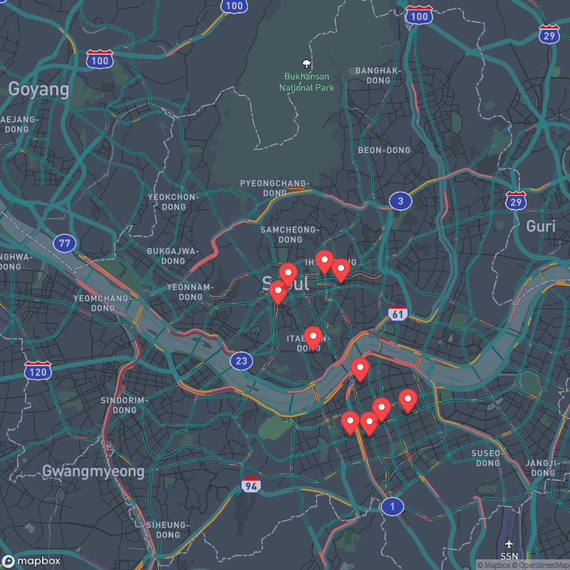
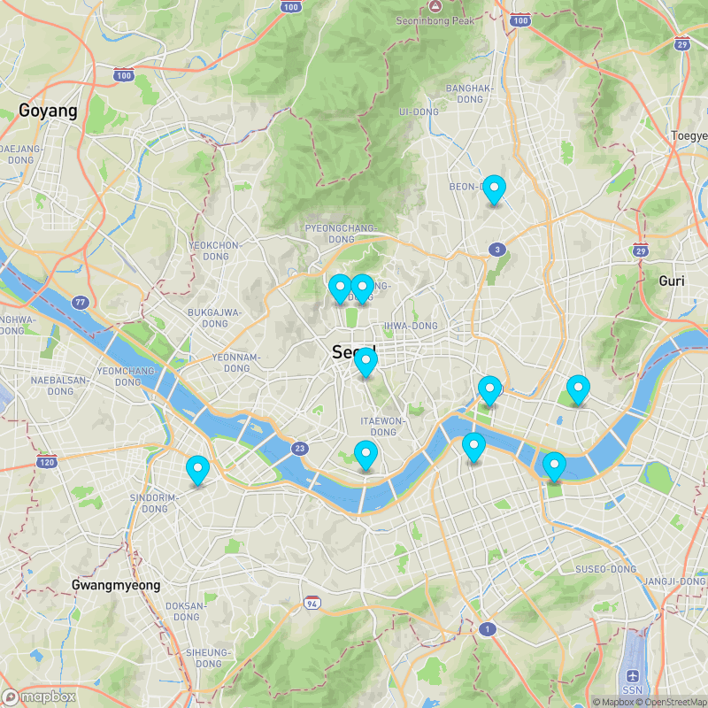

## 🕒 마지막 업데이트: 2026-02-06 16:30:02 (KST)
> **서울시 실시간 도시데이터**를 분석하여 지금 가장 북적인 곳과 여유로운 곳을 10분마다 업데이트합니다.

<!--  -->

---

## 🕒 실시간 현황 (KST)
이 지도는 서울시 API로부터 수집된 데이터를 바탕으로 자동 갱신됩니다.

### 🔥 지금 가장 핫한 곳 (Hot 10)
> 인구 밀도가 높아 활기찬 에너지를 느낄 수 있는 장소들입니다.

---

### 🌿 지금 가장 여유로운 곳 (Chill 10)
> 비교적 인파가 적어 한적하게 산책하거나 휴식하기 좋은 장소들입니다.

---
*본 프로젝트는 학습 목적으로 제작되었습니다. 데이터의 실제 정확도는 서울시 API 제공 상황에 따라 다를 수 있습니다.*